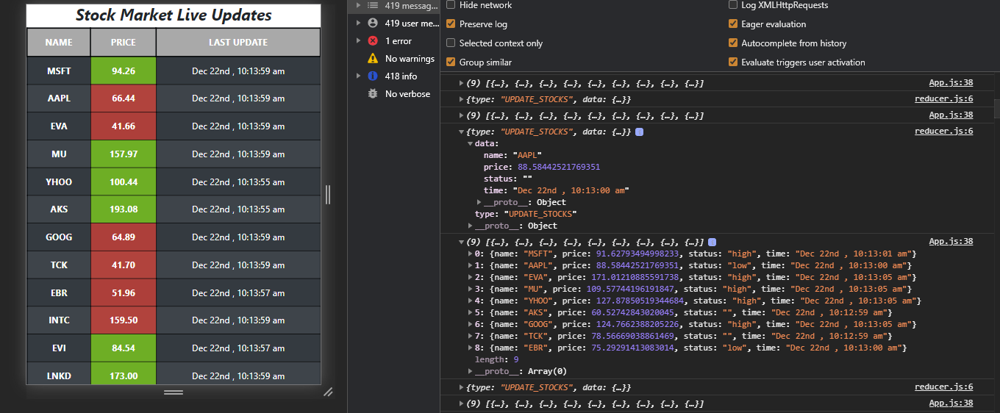

- Getting data from an API in every seconds in an unarranged manner(Updated stock price)
 

- Dispatching the data into reducer one by one

- After reducer operations, getting filtered data into the application

